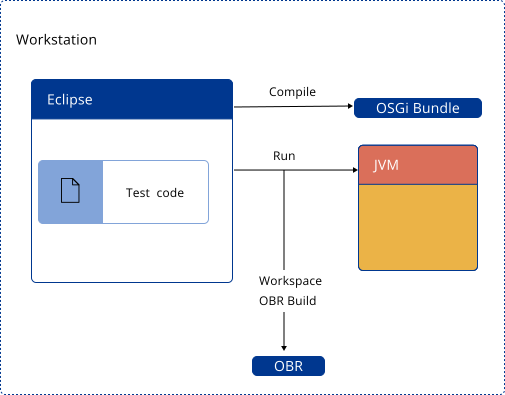
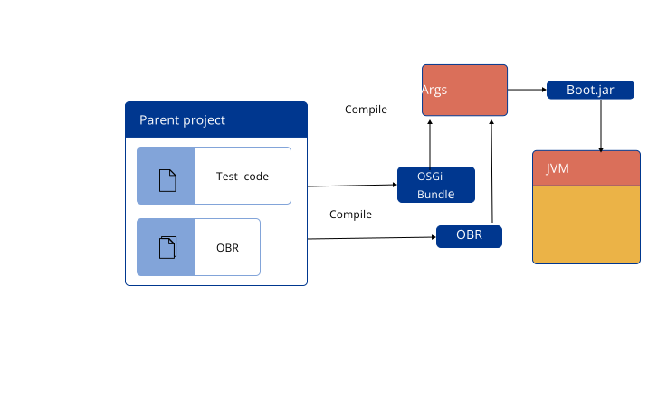

Galasa SimBank shows how you can run a Galasa test locally inside an IDE. Running a test inside an IDE enables test and application development teams to run tests in a local workspace that interacts with real resources - ideal for building a test quickly.

After writing a test to run locally on your machine, start to realise the power of Galasa by running that test in automation inside the [Galasa Ecosystem](/docs/ecosystem).

To run a test in automation inside the Galasa Ecosystem, you need to complete the following high-level tasks:

1. Package a test to [run in automation](/docs/ecosystem/automating)
2. [Deploy the test artifacts to a Maven repository](/docs/ecosystem/deploying-tests)
3. Set up a new test stream
4. Initiate the test from either Eclipse or from the galasactl command line tool

Use this documentation to guide you through the process.

### Running a test inside an IDE
Compiling and running a test locally in Eclipse automatically creates an OSGi Bundle and an OSGi Bundle Repository (OBR) which enables Galasa to run any artifacts that are contained within the workspace.

The following diagram shows how a Galasa test that is created within Eclipse enables you to run the test and interact with resources inside your IDE. Both the test code and the JVM running the test are on your workstation.  Galasa tests are compiled into a OSGi Bundle and this OSGi Bundle is provided to the Galasa runtime which then runs the tests.

When you create your run and run configuration within Eclipse, a workspace OBR build is initiated. The OBR build creates an OSGI bundle repository that represents what is in the workspace, including any tests. The OBR and the compiled test OSGi Bundle are passed to an OSGI environment in which the tests are run. All of this is contained within your IDE.<br><br>

<br><br>

### Running a test outside of an IDE
Structuring tests so that they can be run outside of an IDE means that the tests can be accessed by authorized team members and can be run anywhere.
You can structure tests to be run outside of an IDE by creating a parent project in Eclipse, and adding test code and an OBR as modules to sit within that parent project.<br><br>

<br><br>

The parent project describes the test project, its dependencies and the OBR required to run the test. When the parent project is compiled, an OSGi Bundle and OBR object are generated and these artifacts can be deployed on a Maven repository.

## Struturing your parent project

You can structure your parent project in a number of ways, depending on how you want to manage your test corpus. The structure of the project project is shaped by the way in which you use your OBR. 

An OBR is a collection of all the packages that make up a test selection. Galasa uses the OBR to locate your test project(s) and reason about their interdependencies. You can have an OBR per set of tests, or you can have an OBR for the whole test corpus, or you can set up an OBR per test or per test stream.

In our example, the OBR is set up as a module within the test parent. The example shows how to create a parent project, add a test sub-project and OBR sub-project as modules of that parent, and how to edit the associated _pom.xml_ files so that the parent project and sub-projects (modules) are packaged correctly. 

The parent project establishes all the dependencies for the sub-projects/modules. It builds all the modules in the order of the dependencies - it builds the Manager module before the test projects that use it.

The structure of the parent project in this example will look similar to the following example structure:  

``` 
────com.example.company.mytests.parent 
    │   pom.xml 
    ├───com.example.company.mytests.group1 
    │   │   pom.xml 
    │   └───src 
    │       └───main 
    │           ├───java 
    │           │   │  sampletest.java 
    │           └───resources 
    └─── com.example.company.mytests.obr 
        │   pom.xml 
``` 

Within the parent project is a test bundle, `com.example.company.mytests.group1` that contains a test class, `sampletest.java`. The parent project also contains an OBR module which creates a OBR that describes the test bundle within the parent project. The parent _pom.xml_ stores the build mechanisms for the parent project and any child projects (modules) will inherit these build mechanisms. 


### Next steps
Use the example in the [Running a test in automation](/docs/ecosystem/automating) documentation to guide you through the process of setting up a parent project and run a test in automation outside of an IDE.

