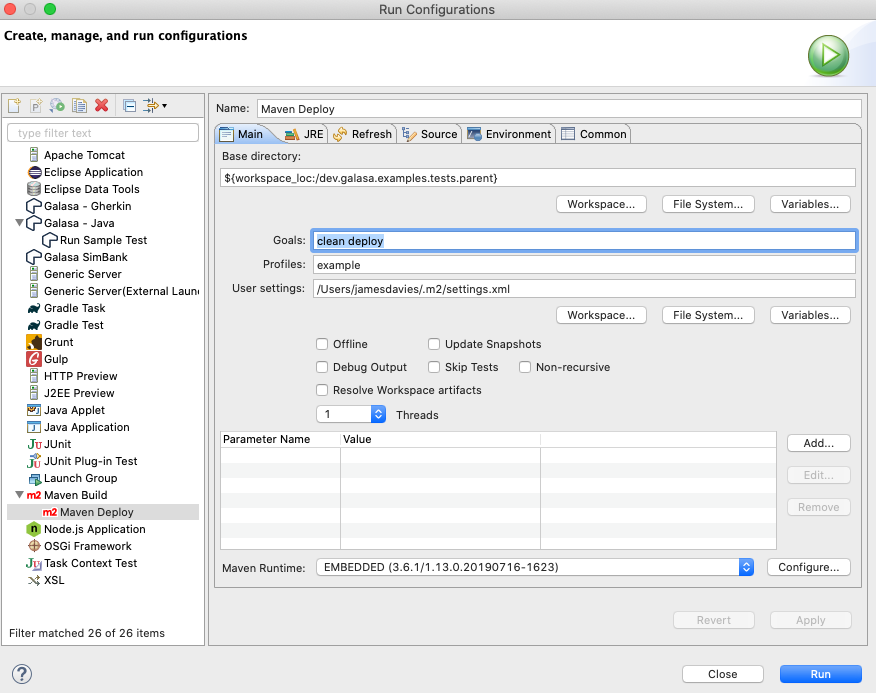

--- 
path: "/docs/ecosystem/automating/deploying-to-maven"
title: "Deploying to a Maven repository"
---

To run a test in automation, all test engines need access to the test material. This is achieved by offering the test material as Maven artifacts. These artifacts are stored in a Maven repository. If you are using the Docker Operator to bring up an ecosystem, a Nexus repository is automatically instantiated, and can be used to store the artifacts. However, you can use any Maven repositories to which you have access. The following example uses a local Nexus repository that can be brought up on a workstation.


Define to Maven where the artifacts are to be deployed by completing the following steps:
1. Create or add to the ```settings.xml`` that is used by Maven.
The following example ```settings.xml``` is also included in the GitHub repository, and can be used as a template:

```
<distributionManagement>
    <repository>
        <id>example</id>
        <url>${example.release.repo}</url>
    </repository>
    <snapshotRepository>
        <id>example</id>
        <url>${example.snapshot.repo}</url>
    </snapshotRepository>
</distributionManagement>
```

In the example, a snapshot and release repository are configured. You might choose to configure these repositories if you have a development and a release stream of your test material. The following definitions are included in the file:

 - A server called _example_. Credentials can be passed to the server for ease, but more secure solutions are offered by Maven.

 - A profile called _example_. The profile is used to define the snapshot and release repositories as well as properties that are used in a Maven deploy setup, allowing repository locations to be changed easily in a single place.

The information is used to deploy artifacts to a Maven repository. You can add a deploy location to a project by adding the definition to the parent project, which can then be used by the child projects. To do this, add the following information in the parent POM:

```
<distributionManagement>
    <repository>
        <id>example</id>
        <url>${example.release.repo}</url>
    </repository>
    <snapshotRepository>
        <id>example</id>
        <url>${example.snapshot.repo}</url>
    </snapshotRepository>
</distributionManagement>
```

Where _<id>example</id>_ refers to the server, and _<url>${example.*.repo}</url>_ refers to the properties that are setup in the profile.
2. Set up a Maven run, either by using the command line or by using Eclpise.
    1. If you are using the command line, use the following example to help you set up a Maven run by using the command line: 
    ```
    mvn -P example clean deploy
    ```
    2. If you are using Eclipse, choose _Run > Run Configurations_ from the main menu and use the following example to help you to set up a run configuration:
    <br><br> 

    After running the command, a _BUILD SUCCESSFUL_ message is displayed in the _Console_ tab .
3. Check that the artifacts are available on the the local repository.

### Next steps

The next step is to set up a test stream. See the [Setting up a test stream](/docs/writing-own-tests/test-streams) documentation for more information on how to do this. 
