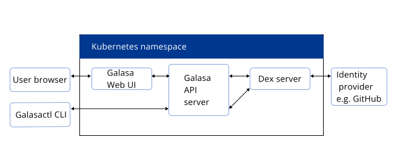

Galasa's Ecosystem organises tests into _streams_. Test streams give you more options when it comes to organising your test projects, how often they are built and where they are deployed. You can have as few or as many test streams as you wish.

A stream is a group of tests that you want to run in automation represented by a single OBR (OSGi Bundle Repository) and its equivalent test catalog. Galasa uses an OBR to locate your tests in a Maven repository, along with all of the Managers that a test project requires. A test catalog is generated directly from the test source, is always up to date, and is what you would specify in the Galasa CLI to select tests to run in automation.


```
galasactl project create \
        --package dev.galasa.example.banking \
      	--features payee,account \
   		--force \
		--obr \
		--log - \
		--maven \
		--gradle
```

- ```--obr``` Creates an OBR project. For tests to run in the Ecosystem they require compiled artifacts to be hosted in a Maven repository. The artifacts must be bundled as an OSGI bundle. 

```
galasactl runs submit local --log - \
--obr mvn:dev.galasa.example.banking/dev.galasa.example.banking.obr/0.0.1-SNAPSHOT/obr \
--class dev.galasa.example.banking.account/dev.galasa.example.banking.account.TestAccount
```


- `--obr` specifies where the  CLI tool can find an OBR which refers to the bundle where the tests are stored. When running locally, all tests must exist in the OBR (or OBRs) that are passed to the tool. The `--obr` parameter specifies the Maven co-ordinates of the obr jar file, in the format `mvn:groupId/artifactId/version/classifier`.

- ```--obr``` Creates an OBR project. An OBR (OSGi Bundle Repository) is an index of OSGi bundles. Galasa testcases are built into OSGi bundles which are then connected into an OBR. When you specify the location of the OBR to Galasa, the OBR tells Galasa where the tests are stored. You can create an OBR from scratch, or you can create projects and add them into an existing OBR. For more information about OBRs, see the <a href="https://felix.apache.org/documentation/subprojects/apache-felix-osgi-bundle-repository.html" target="_blank"> Apache Felix</a> website.

## About test streams

A test stream is made of the following components:

- name
- description
- obr
- location
- repo

The obr is a url that points to a list of maven coordinates in the format mvn:{grp}/{artifact id}/{version}/{obr}
The location is the url that points to the test catalog in the format http://../testcatalog
The repo points to the maven repository

For example, in dev.galasa.example.banking, you have the following in the obr project (dev.galasa.example.banking.obr) in the `0.0.1-SNAPSHOT` folder:
dev.galasa.example.banking.obr-0.0.1-SNAPSHOT-testcatalog.json
dev.galasa.example.banking.obr-0.0.1-SNAPSHOT.obr
dev.galasa.example.banking.obr-0.0.1-SNAPSHOT.pom

The url of the testcatalog and the obr are held on the maven repository in url form, for example, /../../obr and /../../testcatalog.json.


## Creating a test stream on an Ecosystem

A Galasa Ecosystem adminstrator can create test streams in the `framework` namespace on an Ecosystem by using the `galasactl properties set` command. 

You must provide the namespace of `framework`, the name of the stream, the location of the test catalog in url format, a list of maven coordinates, and the name of the Maven repository in the command in the following example format:

```
galasactl properties set --namespace framework --name test.stream.mystream.description --value "My stream to use as an example"
galasactl properties set --namespace framework --name test.stream.mystream.repo --value http://points-to-my-maven-repo
galasactl properties set --namespace framework --name test.stream.mystream.location --value http://points-to-my-test-catalog
galasactl properties set --namespace framework --name test.stream.mystream.obr --value mvn:myorg/myartifact/0.0.1/obr
```

where: 

 - `namespace` is the namespace in which the property is stored - for test streams this must be the framework namespace
 - `name` is the name of the stream that you want to create 
 - `location` is the url that points to the location of the test catalog in the Maven repository
 - `obr` is the url that points to the list of Maven coordinates in the Maven repository
 - `repo` is the name of the Maven repository
 - `description` is a description of the purpose of the stream


If you upgrade to a new version of Galasa, you can update the URLs that contain the version numbers by using the `galasctl properties` set command. Alternatively, you can set the URLs to point to `0.0.1-SNAPSHOT` so that the stream always points to the latest version.


The following diagram shows the architecture for the authentication process:




